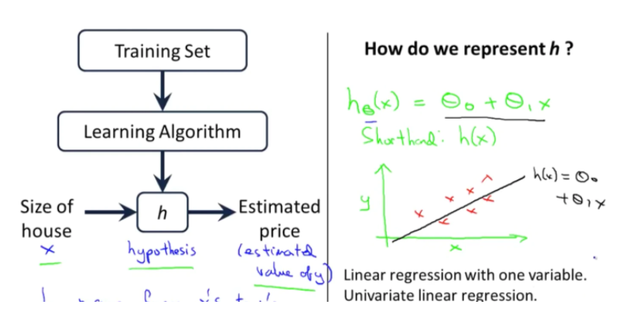
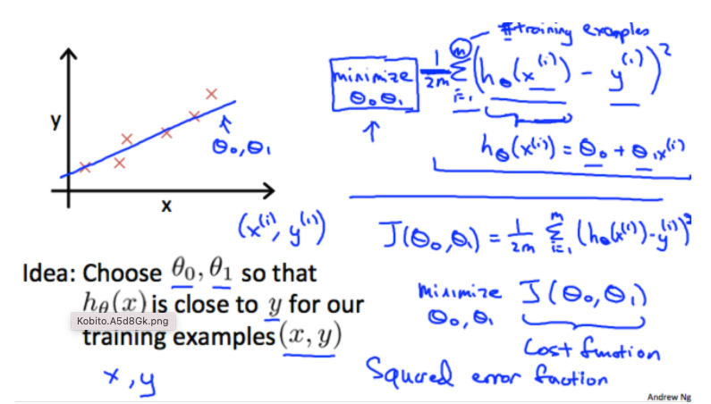

# Week1

## 教師あり学習
* 入力値と出力値のデータセットのサンプルについて「正しい答え」が与えられており、入出力間の関係をアルゴリズムで定義する
* 教師あり学習は以下のような問題に分類できる
  * 回帰問題：連続値の出力を予測→家の価格、身長から体重を予測
  * 分類問題：離産値の出力を予測→癌の良性悪性

## 教師なし学習
* データセットに「正しい答え」は与えられず、データセットのみ。与えられたデータセットからそれを分類するアルゴリズムを予測する
* 教師なし学習は以下のような問題に分類できる
  * クラスタリング：顧客の性別や年齢、趣味、嗜好などにしたがって顧客市場をグルーピング
  * ノンクラスタリング：カクテルパーティー問題：カクテルパーティーのような人が多くいる場所で特定の人の声を抽出する

## モデル定義とコスト関数
### 線形回帰
* 表記について、トレーニングセット$(x^{(i)}, y^{(i)})$のiはi番目のトレーニングセットを指す
* $y=h(x)$の値が実際のyと一致するように$h(x)$を求める。この$h(x)$には色々モデルがあるが、よく使われるのモデルの一つは線形回帰。
$$h(x) = θ_0 + θ_1x$$

※ hはhypothetsis functionの略で仮説関数と呼ばれる。
* トレーニングセットを入力として受け取り、学習アルゴリズムに読み込ませ、関数hを出力する。つまり入力xを受け取って出力yを出す。
* 式は以下のようになる。

### コスト関数
* 仮設関数h(x)が適当かどうかは、以下のコスト関数$J(θ_0, θ_1)$が最小となるかどうかで判定できる
$$J(θ_0, θ_1) = \frac{1}{2m}\sum_{i=1}^{m}(h_θ(x^{i})-y^{i})^2$$

aaa